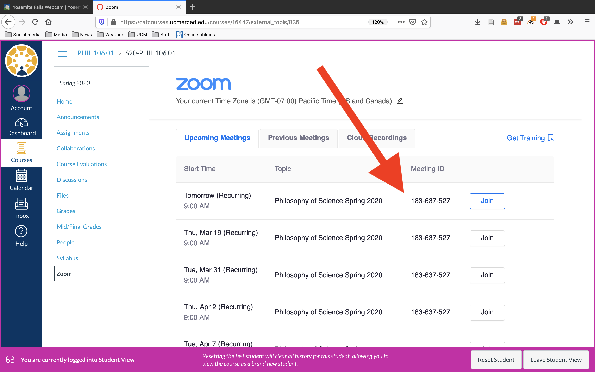
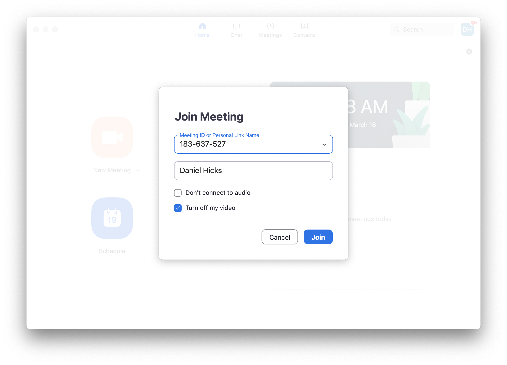

# Accessing the Class Discussions on Zoom #

1. Log in to CatCourses and go to our class site

{width=75%}

2. Look for the Zoom section on the left-hand menu

{width=75%}

3. The Zoom section shows a list of scheduled class Zoom sessions.  Click Join.  

4. Zoom will open a new launching page.  
	- If you haven't installed the Zoom client on your machine, you should get a prompt to approve a download and install.  
	- After Zoom is installed, the launching page should automatically open the Zoom client. 
	
{width=75%}

5. **If Zoom doesn't download**, go to this site and download and install manually:  <https://support.zoom.us/hc/en-us/articles/201362233-Where-Do-I-Download-The-Latest-Version->

6. **If Zoom is installed but doesn't open the meeting automatically**, check CatCourses for the Meeting ID for the meeting you're trying to join.  Open the Zoom client yourself.   Look for a "Join" option, and enter the Meeting ID in the appropriate box. 

{width=75%}

{width=75%}